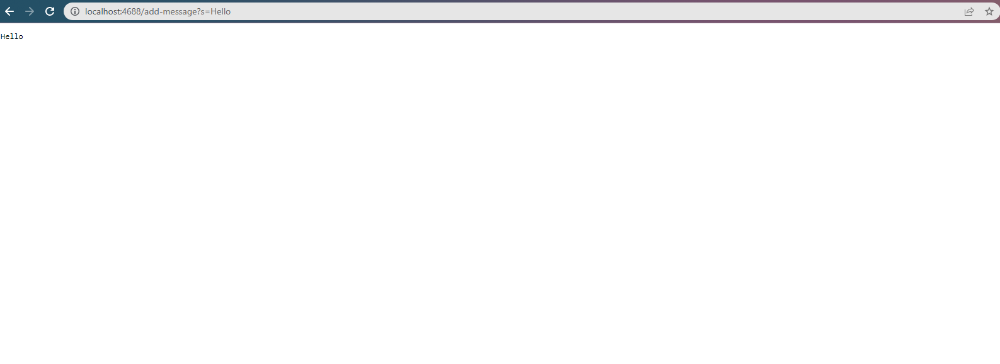
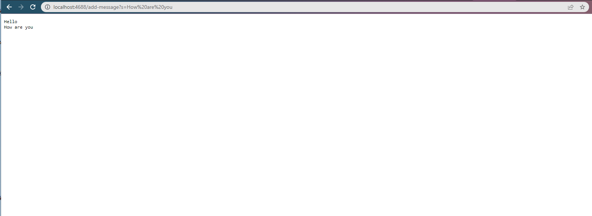
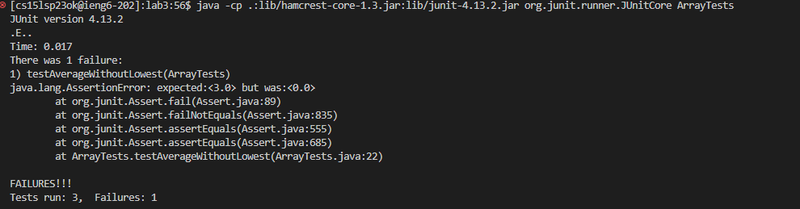
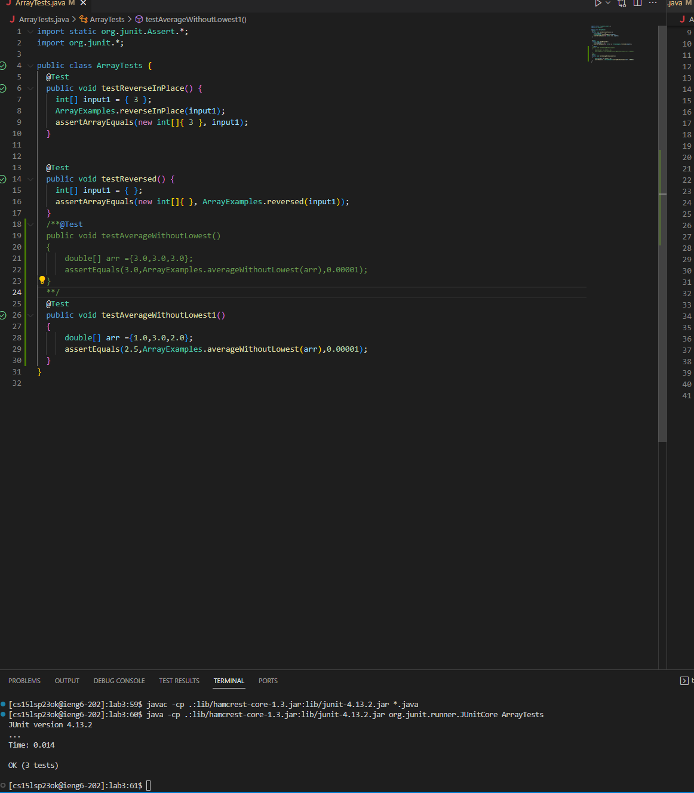

>
Name:Chaklam Ng
>
Professor Joe
>
CSE 15L
>
4/23/2023
>
___
Welcome to read my cse15l lab report 2.
___
# Part1 Implementing StringServer
>
The following code is the StringServer which is a webserver that will accept path as the following format `/add-message?s=<string>` and it will typically show the string of the path in the web server page.
```
import java.io.IOException;
import java.net.URI;
import java.net.URL;
import java.util.ArrayList;

class Handler implements URLHandler{
    private String message = "";
    @Override
    public String handleRequest(URI url) {
        String[] urlParams = getURLParams(url);
        String[] path = splitPath(url);
        if(path.length==0)
        {
            return "nothing";
        }
        if(path[0].equals("add-message")){
            if(urlParams.length==0)
            {
                return "no params";
            }
            if(urlParams.length>2)
            {
                return "too many params";
            }
            if(urlParams[0].equals("s"))
            {
                message+=urlParams[1]+"\n";
                return message;
            }
            return "unrecognized param:"+urlParams[0];
        }
        return "unrecognized path";
    }
    //helper method
    private String[] getURLParams(URI url){
        if(url.getQuery()!=null)
        {
            return url.getQuery().split("=");
        }
        return new String[0];
    }
    private String[] splitPath(URI url)
    {
        String[] path = url.getPath().split("/");
        ArrayList<String> pathlist = new ArrayList<>();
        for(String p: path)
        {
            if(p.isEmpty()==false)
            {
                pathlist.add(p);
            }
        }
        return pathlist.toArray(new String[0]);
    }
}
public class StringServer {
    public static void main(String[] args) throws IOException
    {
        if(args.length == 0)
        {
            System.out.println("Missing port number! Try any number between 1024 to 49151");
            return;
        }

        int port = Integer.parseInt(args[0]);

        Server.start(port, new Handler());
    }

}
```
This is similar to the one we have done on lab2 about number server. However, I tried to add some helper methods to help me better build up the Handler for string server.By running the command `javac StringServer.java` and `java StringServer 4688`. Now the system will return me a webpage which will look exactly as the following.

Now the first string path I have tried is `/add-message?s=Hello` and the page would show as the following page which is showing a string word Hello in the page.

The url is `http://localhost:4688/add-message?s=Hello`. Typically, the method handlerequest in the class handler is called with an URI object as an argument to parse in. The method will call two helper methods to get the string field of the path of the url and add it to the page.
>
The second string path i have tried is `/add-message?s=How are you` and it shows as the following screenshot.

The method handler.handlerequest(URI url) is called by parsing in the url `http://localhost:4688/add-message?s=How%20are%20you` and typically the argument is an URI object and it will return the string field in the method.

# Part 2 Junit Test
The buggy program function is inside the ArrayExample.java which is the AverageWithoutLowest method.
## Failing test
```
@Test 
  public void testAverageWithoutLowest()
  {
      double[] arr ={3.0,3.0,3.0};
      assertEquals(3.0,ArrayExamples.averageWithoutLowest(arr),0.00001);
  }
 ```
 The above unit test will fail the method.
## output

 ```
 [cs15lsp23ok@ieng6-202]:lab3:56$ java -cp .:lib/hamcrest-core-1.3.jar:lib/junit-4.13.2.jar org.junit.runner.JUnitCore ArrayTests
JUnit version 4.13.2
.E..
Time: 0.017
There was 1 failure:
1) testAverageWithoutLowest(ArrayTests)
java.lang.AssertionError: expected:<3.0> but was:<0.0>
        at org.junit.Assert.fail(Assert.java:89)
        at org.junit.Assert.failNotEquals(Assert.java:835)
        at org.junit.Assert.assertEquals(Assert.java:555)
        at org.junit.Assert.assertEquals(Assert.java:685)
        at ArrayTests.testAverageWithoutLowest(ArrayTests.java:22)

FAILURES!!!
Tests run: 3,  Failures: 1
```
## passing test
```
@Test
  public void testAverageWithoutLowest1()
  {
      double[] arr ={1.0,3.0,2.0};
      assertEquals(2.5,ArrayExamples.averageWithoutLowest(arr),0.00001);
  }
 ```
 ## Passing output
 
 
 ## Code before change
 ```
 // Averages the numbers in the array (takes the mean), but leaves out the
  // lowest number when calculating. Returns 0 if there are no elements or just
  // 1 element in the array
  static double averageWithoutLowest(double[] arr) {
    if(arr.length < 2) { return 0.0; }
    double lowest = arr[0];
    for(double num: arr) {
      if(num < lowest) { lowest = num; }
    }
    double sum = 0;
    for(double num: arr) {
      if(num != lowest) { sum += num; }
    }
    return sum / (arr.length - 1);
  }
  ```
  ## Code after change
  ```
   // Averages the numbers in the array (takes the mean), but leaves out the
  // lowest number when calculating. Returns 0 if there are no elements or just
  // 1 element in the array
  static double averageWithoutLowest(double[] arr) {
    if(arr.length < 2) { return 0.0; }
    int index=0;
    double lowest = arr[0];
    for(int i=1;i<arr.length;i++){
        if(arr[i]<lowest){
            index = i
         }
    }
    double sum = 0;
    for(int i=0;i<arr.length;i++){
        if(i!=index)
        {
            sum+= arr[i];
        }
    }
    return sum / (arr.length - 1);
  }
  ```
Basically, the code before change will not work if all elements are the same as lowest. However, I changed this issue by setting the lowest element index and basically sum up skipping that particular index will return the correct sum and return the correct average.

# Part3
Something that I learn from lab2 is to build up web server. Indeed, I have never tried to build a web server by myself. After that lab, I found that build any kind of web server is pretty fun and useful. For lab3, I have learned that how to use Junit test for testing the java program in order to make my own program work correctly for each function.
>
